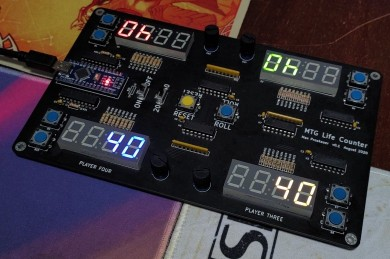

# MTG Life Counter v2
Four player life counter for *Magic: The Gathering*

**Version 2 is still WIP**

Check out the [Version 1 branch](https://github.com/mprosk/mtg_life_counter/tree/v1_tht) (pictured below)

## v2 To Do

- Get photo of v2
- Improve denounce of encoders
- Change modes by clicking encoder button once
- Allow Roll result be cleared by any input
- Possibly use `micros()` for RNG

## Features

- Easily track the life of up to four players
- Each player can track poison counters and commander damage from the other three players, including partner commanders
- Supported life totals of -999 to 9999
- Selectable starting life of 20, 30, or 40
- "Roll" button for randomly selecting the starting player

## Hardware

- ATmega328P (Arduino Nano)
- 4x common cathode 4-digit 7-segment displays
- 4x rotary encoders with switches and detents
- 2x 12mm tactile switches
- 4x 74HC595 for segment driving
- 2x TPIC6B595 for sinking digit current
- 1x 74HC165 for encoder capture

## Theory of Operation

There are two main subsystems within the counter's design, the control input sensing, and the 7-segment display driver.

# Operating Instructions

### Power

1. Plug a USB Type C cable into the connector and set the power switch to ON. The display will initialize to the selected starting life total
5. To turn off the display, move the power switch to the OFF position or unplug the USB cable

### Mode Select

1. To switch the counter between different starting life totals, use the 20/40 switch to select the mode. Changing this switch will reset the counters
2. To select a starting life of 30, press and hold the yellow reset button while changing the 20/40 mode switch. The setting of the switch does not matter so long as the reset button is held while it is changed

### Tracking Life and Damage

Each player uses one corner of the board, which contains the 7-segment display, and a rotary encoder for changing the counter's value, and selecting the display mode

#### Selecting Display Mode

TODO

#### Changing the Value

1. Once the desired mode has been selected, adjust that value by rotating the encoder
2. When the encoder is adjusted, the counter will show the change in value that is being entered. After a brief timeout, the display will switch to showing the new updated value

#### Resetting the Counters

1. To reset **ALL** the counters, press the yellow reset button in the middle of the board
2. You can also reset an individual counter by pressing both the directional buttons for that counter at the same time

### Roll Button

The ROLL button on the counter allows you to quickly and easily select a player at random, useful for determining which player starts, or even for randomly selecting which player you should deal damage to.

To activate this feature, press and hold the blue ROLL button in the middle of the counter. When you are ready, release the button, and the random output will be shown on the displays. The result disappears after a few seconds.

For two-player games, simply use whichever half of the device the play lands on to determine starting player

#### Random Number Generation

While the device is on, there is a counter being continuously incremented. When the ROLL button is released, the value of this counter `mod` 4 determines which player won the roll. This counter increments approximately  250,000 times per second, so it is virtually impossible for a human to actuate the button with enough precision to influence the output of the roll.

#  Next Hardware Revision

List of features and fixes that may be considered in the next hardware revision

- SMD buttons, resonator
- Replace encoders with buttons
  - Remove 74HC165 - wire buttons direct to Atmega
  - Use double button push to change modes
- Battery power
